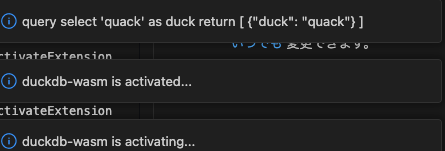

# simple-duckdb-example README
A simple extension example with DuckDB-wasm

# How to build/run

Build an extension (vsix) file
```
npx vsce package --allow-missing-repository
```

Then, install the vsix file and run `Hello DuckDB WASM`



# How I made this

1. Create scaffold VSCode extension code with `npx --package yo --package generator-code -- yo code`
2. Install necessary npm packages
3. Add TypeScript code (extension.ts/duckdb.ts)
4. Change bundle configs
   * Contains worker and WASM files

# Special Thanks

* [Article by YutaUra](https://zenn.dev/yuta_ura/articles/duckdb-wasm-in-vscode-extension#module-not-found-vscode-%E3%82%A8%E3%83%A9%E3%83%BC%E3%81%8C%E7%99%BA%E7%94%9F%E3%81%99%E3%82%8B%E3%81%93%E3%81%A8%E3%81%8C%E3%81%82%E3%82%8B)